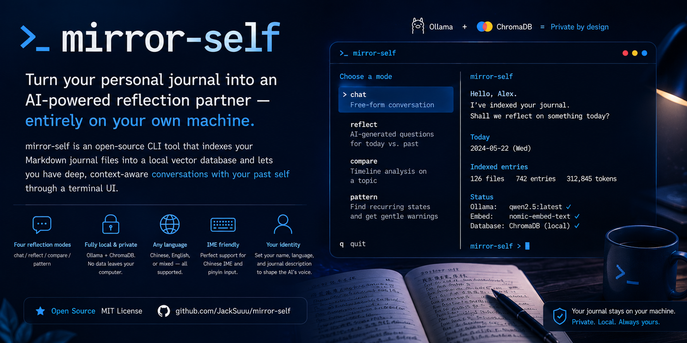

# mirror-self

> Turn your personal journal into an AI-powered reflection partner — entirely on your own machine.

`mirror-self` is an open-source CLI tool that indexes your Markdown journal files into a local vector database and lets you have deep, context-aware conversations with your past self through a terminal UI.

No data ever leaves your computer. Everything runs locally via [Ollama](https://ollama.ai).



---

## Features

- **Four reflection modes**
  - `chat` — free-form conversation with your journal
  - `reflect` — AI-generated questions based on today's date vs. past entries
  - `compare` — timeline analysis of how you've changed on a topic
  - `pattern` — describe your current state; get a warning if you've been here before
- **Fully local** — Ollama + ChromaDB, no API keys, no cloud
- **Any language** — works with Chinese, English, or mixed-language journals
- **Chinese IME support** — the TUI correctly handles pinyin / input composition
- **Configurable identity** — set your name, language, and a short journal description so the AI adapts its voice to you

---

## Requirements

- Python 3.10+
- [Ollama](https://ollama.ai) running locally
- Recommended models (pull once):

```bash
ollama pull qwen2.5:latest       # LLM — strong Chinese/English understanding
ollama pull nomic-embed-text     # Embedding model
```

---

## Installation

```bash
pip install mirror-self
```

Or clone and install in editable mode for development:

```bash
git clone https://github.com/JackSuuu/mirror-self.git
cd mirror-self
pip install -e .
```

---

## Quick start

```bash
# 1. Index your journal (run once; re-run to pick up new entries)
mirror-self init \
  --journal /path/to/your/journal \
  --name "Your Name" \
  --language "Chinese" \
  --description "personal diary, Chinese and English, 2022–present"

# 2. Check everything is working
mirror-self status

# 3. Start reflecting
mirror-self chat
mirror-self reflect
mirror-self compare
mirror-self pattern
```

---

## Journal format

Your journal directory should contain Markdown files (`.md`). Each file can hold multiple entries separated by date headers. The following date formats are all recognised:

```
# 2024年3月15日
## March 15, 2024
### 2024-03-15
#### 24/3/15
##### 15th March 2024
```

One file per month works well, but any layout is fine as long as dates appear as headings.

---

## Configuration

All settings are stored in `~/.config/mirror-self/config.json`.

```bash
# View current config
mirror-self config --show

# Change individual values without re-indexing
mirror-self config --name "Alex" --language "English" --llm-model "llama3.2"
```

| Key | Default | Description |
|-----|---------|-------------|
| `journal_path` | — | Path to your journal directory |
| `user_name` | `User` | Your name — used in AI prompts |
| `language_hint` | `auto` | Response language: `auto`, `Chinese`, `English`, `mixed`, or any description |
| `journal_description` | — | Short description shown to the LLM |
| `llm_model` | `qwen2.5:latest` | Ollama model for chat |
| `embed_model` | `nomic-embed-text` | Ollama model for embeddings |
| `ollama_base_url` | `http://localhost:11434` | Ollama server URL |

---

## Data & privacy

| What | Where |
|------|-------|
| Config | `~/.config/mirror-self/config.json` |
| Vector index | `~/.local/share/mirror-self/chroma/` |

Your journal files are **never modified**. The index is a local ChromaDB database; nothing is sent to any external service.

---

## Architecture

```
mirror-self init
  └── indexer.py   parse Markdown → JournalEntry objects
                   embed via Ollama (nomic-embed-text)
                   upsert into ChromaDB

mirror-self chat / reflect / compare / pattern
  └── retriever.py  semantic search → top-k entries (year-spread aware)
      prompts.py    build system + user prompt from conf + retrieved context
      llm.py        stream response from Ollama (qwen2.5 or any model)
      tui/app.py    Textual TUI with IME-safe input and loading animation
```

---

## Contributing

Pull requests are welcome. Please open an issue first to discuss significant changes.

```bash
git clone https://github.com/JackSuuu/mirror-self.git
cd mirror-self
pip install -e .
```

---

## License

MIT
